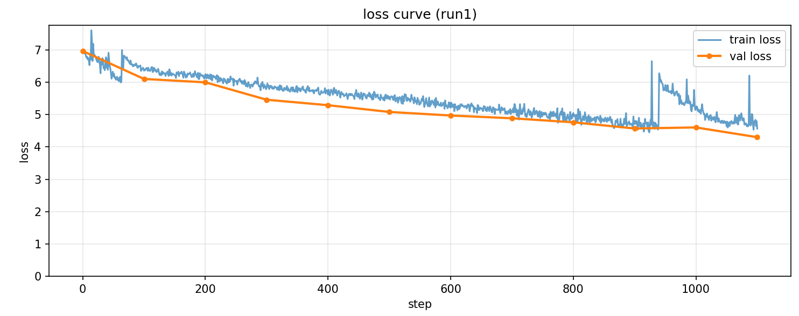
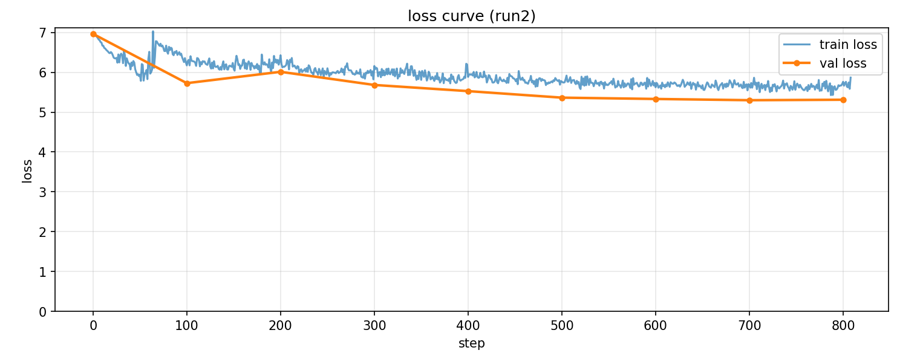
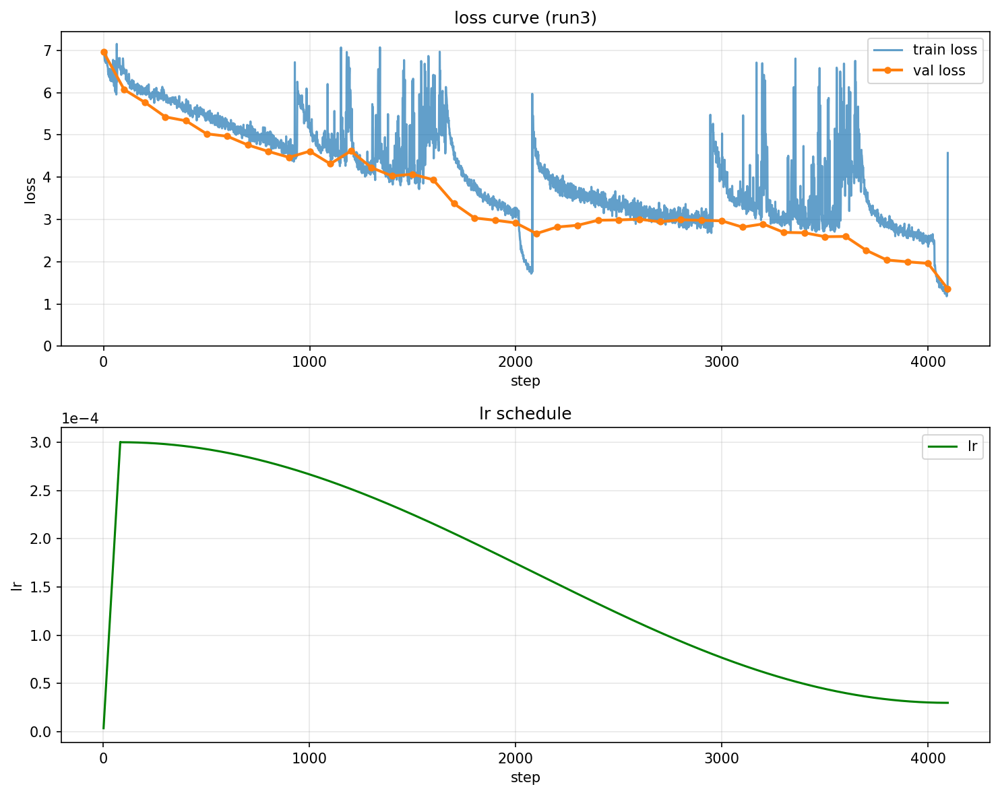

# CLIP 

From-scratch [CLIP](https://openai.com/index/clip/)-like model for tinkering & learning 

## TODOs
1. Add evals (eg ImageNet ZeroShot)
2. Make dataloader way faster (potentially pre-save tensors) & shuffle data
3. Run experiments to see how much we can improve
4. Add some sort of cool UI to interact with pretrained model

## "Water through the Pipes" Tests

|          | TextDecoder | VisionEncoder |
|----------|-------------|---------------|
| n_layer  |      6      |       8       |
| n_head   |      8      |       6       |
| n_embd   |     512     |      768      |
| out_dim  |     512     |      512      |
|  block   |      77     |       -       |
| img_size |      -      |      224      |
|patch_size|      -      |       16      |

#### Test 1
- *batch=1024, epochs=0.5, max_lr=3e-4*
- *linear warmup for 2% of steps, then cosine decay down to 10%*
- *val_loss (0.5 epoch): 4.603*

Notes: 
- Likely need to add data shuffling
- Gradient norms are quite high still (~5), could consider higher lr

#### Run 2
- *batch=1024, epochs=0.5, max_lr=1e-3*
- *linear warmup for 10% of steps, then cosine decay to 10% of max_lr*
- *val_loss (0.4 epoch): 5.311*

Notes: 
- With higher max_lr (1e-3) gradients vanished very quickly
- With a longer warmup, this is no longer a problem, but convergence is much slower

#### Run 3
- *batch=1024, epochs=2, max_lr=3e-4*
- *linear warmup for 2% of steps, then cosine decay to 10% of max_lr*
- *val_loss (2 epoch): 1.356*

Notes: 
- Continuing to converge after 2 epochs → can train for longer
- Strong loss periodicity → need to shuffle training data

## Files
- `clip.ipynb` notebook used to sketch out & test each component 
- `clip.py` model definition 
- `prep_dataset.py` downloads [text-to-image-2M](https://huggingface.co/datasets/jackyhate/text-to-image-2M) dataset, resizes images, and saves local shards 
- `dataloader.py` simple data loader that loads each shard tarfile into memory, and provides batches for training 
- `train.py` training script 
- `logger` simple logger to track training metrics & create graphs
- `checkpoint_manager` utility functions to save checkpoints while training and load/resume from checkpoints 
- `setup_{}.sh` scripts for env setup on  new boxes
